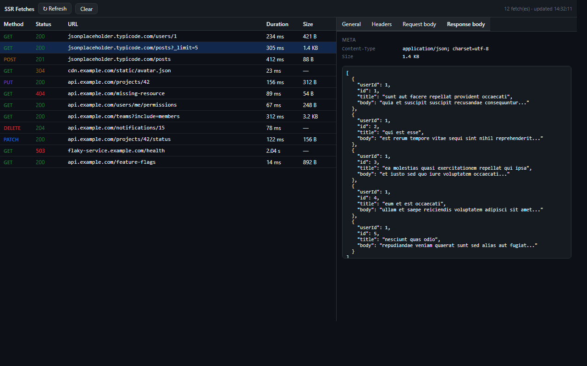

# ssr-devtools

[](./README.md) [](./README.en.md)

> **Chrome DevTools extension + server package for debugging Next.js App Router SSR `fetch()` calls**

[](https://www.npmjs.com/package/@leesuyeon/ssr-devtools)
[](https://www.npmjs.com/package/@leesuyeon/ssr-devtools)
[](https://chromewebstore.google.com/detail/nextjs-ssr-devtools/pjnjiopickmfphfiomfondfmbkdhkbnm)
[](./LICENSE)



> ⚠️ **Both pieces are required for this to work**
>
> 1. **The npm package** — install it into your Next.js app and wire it up so the server starts collecting SSR fetch data.
> 2. **The Chrome extension** — you **must** install it from the [Chrome Web Store](https://chromewebstore.google.com/detail/nextjs-ssr-devtools/pjnjiopickmfphfiomfondfmbkdhkbnm) to view that data in the "SSR Fetches" DevTools panel shown above.
>
> The package alone collects data but has no UI to show it. The extension alone has nothing to read.

## Quick Install

```bash
npm install @leesuyeon/ssr-devtools
```

📦 **npm**: https://www.npmjs.com/package/@leesuyeon/ssr-devtools

After running the command above, follow the [integration guide](#integrate-into-your-nextjs-project) — a few lines across 4 files — and then install the Chrome extension as described in the [Install the extension](#install-the-extension) section.

---

## The problem: SSR data fetching is hard to debug

In Next.js App Router, `fetch()` calls inside Server Components run **inside the Node.js server only**. The browser receives just the rendered HTML, so **nothing shows up in the DevTools Network tab.**

Consequences:
- You can't see which URL was called with which method
- You can't inspect request/response headers
- You can't peek into the response body
- You don't know the response latency
- Non-developers (QA/PM) have no way to verify "exactly what data does this page receive?"

The usual workarounds — `console.log` or `next.config`'s `logging.fetches.fullUrl` — only print to the terminal, so non-developers can't see them. OpenTelemetry/Sentry are heavyweight and require a separate backend.

## The solution: capture on the server → render in a DevTools panel

The project has two parts:

```
┌──────────────────────────────┐         ┌──────────────────────────┐
│  Next.js Node server         │         │  Browser                 │
│                              │         │                          │
│  Patches globalThis.fetch    │         │   "SSR Fetches" panel    │
│  → collects URL/method/      │  HTML   │   reads requestId from   │
│    status/duration/headers/  │ ──────► │   <script> marker,       │
│    body                      │         │   calls API,             │
│                              │         │   renders table + detail │
│  Stored per-session in       │ ◄────── │                          │
│  in-memory registry          │  fetch  │                          │
│  Exposed at                  │         │                          │
│  /api/ssr-devtools           │         │                          │
└──────────────────────────────┘         └──────────────────────────┘
```

**Developers**: one `npm install` + 3 lines of wiring — done.
**Non-developers (QA/PM)**: install one Chrome extension → open DevTools → click "SSR Fetches" tab — done.

## How it works

### 1. Intercepting SSR fetches — `globalThis.fetch` monkey-patch

Next.js's `instrumentation.ts` hook runs once at server startup. We swap `globalThis.fetch` for our wrapper there. Every subsequent `fetch()` from a Server Component goes through our wrapper.

```ts
const original = globalThis.fetch;
globalThis.fetch = async (input, init) => {
  const startedAt = Date.now();
  const response = await original(input, init);
  // collect URL, method, status, duration, headers, body
  recordEntry({ ... });
  return response;
};
```

The body is a stream that can only be read once, so we `response.clone()` and read up to the size limit (default 100KB) before truncating.

### 2. Grouping fetches by request — `next/headers` + WeakMap

When multiple fetches happen, we need to group them by request. This is trickier than it sounds:

- React's `cache()` is **scoped per route segment** — `app/layout.tsx` and `app/page.tsx` see different cache instances even within the same request → can't use it.
- Node's `AsyncLocalStorage` would require us to wrap the request handler ourselves, which we can't do → can't use it.

Solution: leverage the fact that **`next/headers`'s `headers()` returns the same Headers object reference within one request**, and key on it via `WeakMap<Headers, Session>`.

```ts
function getCurrentSession() {
  const h = headers(); // same reference within one request
  let session = sessionByHeaders.get(h);
  if (!session) {
    session = { requestId: randomUUID(), entries: [] };
    sessionByHeaders.set(h, session);
  }
  return session;
}
```

Both the patched fetch and the `<SSRDevtoolsScript />` (described below) see the same session.

### 3. Sending data to the browser — `<script>` marker + API route

To ferry the server-collected data over to the browser, we add two pieces.

**`<SSRDevtoolsScript />`** (1 line in `layout.tsx`): bakes the current requestId into the HTML.
```html
<script data-ssr-devtools data-ssr-devtools-request-id="..." data-ssr-devtools-api-path="/api/ssr-devtools"></script>
```

**`app/api/ssr-devtools/route.ts`**: looks up that requestId in the in-memory registry and returns the session as JSON.

> Subtle point: Server Component siblings render **concurrently**, so `<SSRDevtoolsScript />` may render *before* the fetches inside `{children}` resolve. It still works — both share the **same session object** (stored in the WeakMap), so when fetches resolve later and call `session.entries.push(...)`, the registry's session gets updated. By the time the extension calls the API, it's already populated.

### 4. The Chrome DevTools extension

It's an MV3 extension and needs no `host_permissions` — `chrome.devtools.inspectedWindow.eval` runs in the page context directly.

```js
// 1. Read the marker from the page
const { requestId, apiPath } = readMarker();
// 2. Fetch from the same origin (browser handles it, so no permissions needed)
const session = await fetch(apiPath + '?id=' + requestId).then(r => r.json());
// 3. Render the table + detail panel
```

Auto-refreshes on page navigation (`chrome.devtools.network.onNavigated`).

## Repo layout

| Path | Contents |
|---|---|
| `packages/server/` | `@leesuyeon/ssr-devtools` — the npm package consumed by Next.js apps |
| `packages/extension/` | Chrome MV3 DevTools extension |
| `examples/nextjs-demo/` | Demo app for end-to-end verification |

## Integrate into your Next.js project

> Requires **Next.js 14+ App Router**. On 14.x you must also enable `experimental.instrumentationHook: true` in `next.config` (it's stable in 15.0+).

### 1. Install the package

```bash
npm install @leesuyeon/ssr-devtools
```

### 2. `instrumentation.ts` (project root)

```ts
export async function register() {
  if (process.env.NEXT_RUNTIME === "nodejs") {
    const { setup } = await import("@leesuyeon/ssr-devtools/instrumentation");
    setup({ enabled: process.env.NODE_ENV !== "production" });
  }
}
```

### 3. `next.config.mjs` (Next 14.x only)

```js
export default {
  experimental: { instrumentationHook: true },
};
```

### 4. `app/layout.tsx`

```tsx
import { SSRDevtoolsScript } from "@leesuyeon/ssr-devtools/react";

export default function RootLayout({ children }) {
  return (
    <html>
      <body>
        {children}
        <SSRDevtoolsScript />
      </body>
    </html>
  );
}
```

### 5. `app/api/ssr-devtools/route.ts`

```ts
export { GET } from "@leesuyeon/ssr-devtools/route";
```

> The folder name must NOT start with `_` — App Router treats those as private folders and excludes them from routing.

## Install the extension

Pick whichever method suits you.

### Option 1: Chrome Web Store (recommended)

1. [**Install from the Chrome Web Store**](https://chromewebstore.google.com/detail/nextjs-ssr-devtools/pjnjiopickmfphfiomfondfmbkdhkbnm) → click "Add to Chrome"
2. Open your Next.js page, hit DevTools (F12) → **SSR Fetches** tab

### Option 2: Load unpacked from source (dev/customization)

1. Clone this repo or [download as ZIP](https://github.com/leeyounagh/ssr-devtools/archive/refs/heads/main.zip) and unzip
2. Open `chrome://extensions`
3. Toggle **Developer mode** in the top right
4. Click **Load unpacked** → select the `packages/extension/` folder
5. Open your Next.js page, hit DevTools (F12) → **SSR Fetches** tab

## Things to know

- **The first page load**'s SSR fetches are captured automatically — the marker emitted by `<SSRDevtoolsScript />` carries the initial render's session ID, so they appear as soon as you open the panel.
- **Subsequent server-side requests** (Server Actions, route handlers, `revalidate`, mutations triggered by form submit, etc.) each run in a **fresh request context** with a **fresh session**. The panel does **not auto-refresh** for these, so after triggering a server action you'll need to click the **Refresh** button in the panel to see the new fetches.
- Full page navigations *do* auto-refresh (`chrome.devtools.network.onNavigated`). App Router's soft client-side navigation requires a manual Refresh.
- Live polling / SSE push is on the roadmap. For now, Refresh is the contract.

> **Why does it work this way?** — Every server-side request in Next.js runs in its own fresh `headers()` object and request context. This package isolates per-request state via `WeakMap<Headers, Session>`, but the marker baked into the page only carries the initial render's session ID, so fetches from later server actions live in a different session. On Refresh the panel queries the list-sessions endpoint and merges entries from every session started at-or-after this page load.

## Configuration

```ts
setup({
  enabled: true,
  maxBodySize: 100_000,         // bytes; truncated above this
  maxSessions: 200,             // most-recent sessions kept in memory
  redactHeaders: ["authorization", "cookie", "set-cookie", "x-api-key"],
  apiPath: "/api/ssr-devtools", // must match the folder where you placed route.ts
});
```

## Local development

```bash
npm install
npm run build               # build the server package
npm run demo                # start the demo → http://localhost:3000
```

After editing `packages/server/src/*`, rebuild that workspace with `npm run build` and restart the demo (Next.js caches the instrumentation module at boot).

## Releasing (publish)

Bump the version in `packages/server/package.json` and push a matching tag — GitHub Actions auto-publishes `@leesuyeon/ssr-devtools` to the **public npm registry**.

**One-time setup**:
1. Sign up at [npmjs.com](https://www.npmjs.com/signup)
2. Access Tokens → Generate New Token → **Automation** (or Granular: scope `@leesuyeon`, permission `Read and write`)
3. GitHub repo → Settings → Secrets and variables → Actions → New secret named `NPM_TOKEN` with that token

**For each release**:
```bash
# 1. Bump "version" in packages/server/package.json to e.g. 0.1.1 and commit
# 2. Create + push the tag
git tag v0.1.1
git push origin v0.1.1
```

The workflow fails if the tag and `package.json` versions don't match.

## License

MIT
